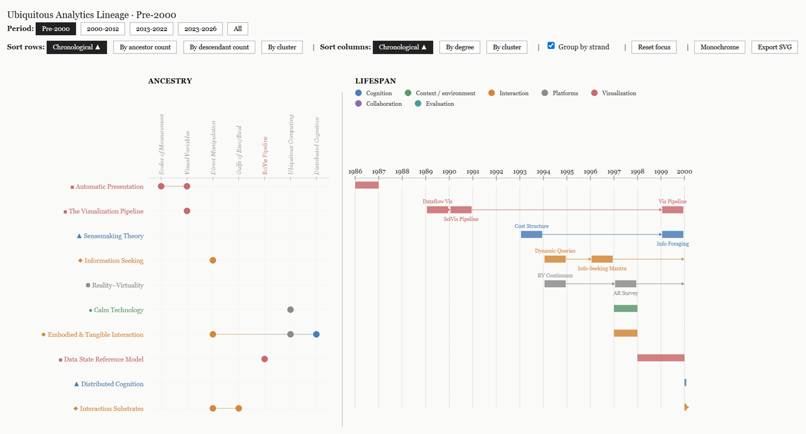

# Ubiquitous Analytics Lineage

An interactive [D3](https://d3js.org/) visualization of the intellectual lineage of
research themes — an **ancestry matrix** paired with a **lifespan timeline**. Each theme
is a row whose lifespan is drawn as a Gantt-style bar; the matrix on the left shows which
earlier themes it descends from. It accompanies a forthcoming book on ubiquitous
analytics, but stands on its own as a tool for exploring how ideas beget one another.



## Features

- **Period filtering** — scope the view to a time window (Pre-2000, 2000–2012,
  2013–2022, 2023–2026, or All).
- **Row sorting** — chronological, by ancestor count, by descendant count, or by cluster.
- **Column sorting** — chronological, by degree, or by cluster.
- **Group by strand** — collapse a multi-paper strand onto a single segmented row.
- **Monochrome mode** — a Bertin achromatic encoding (shape + texture instead of hue)
  for print.
- **Focus & hover linking** — click a row or column to lock focus on its ancestry;
  hover to preview the linked row/column band across both panels.
- **SVG export** — download the current view as a standalone, dependency-free `.svg`.

## Running locally

This is plain HTML and JavaScript — no build step and no install. D3 v7 is loaded from a
CDN. Because the page fetches a local JSON file (`json/data.json`), browsers will block it
if you open `index.html` directly via `file://`. Serve the folder over HTTP instead:

```sh
python -m http.server 8000
# then open http://localhost:8000/
```

Any static file server works — for example `npx serve` (then open the printed URL).

## Data format

The dataset lives in [`json/data.json`](json/data.json). It has two parts: a `themes`
array (the nodes) and a `strands` map (named groupings of themes). Each theme looks like:

```json
{
  "id": "SANDBOX",
  "name": "The Sandbox for Analysis",
  "shortName": "Sandbox for Analysis",
  "cluster": "cognition",
  "type": "foundation",
  "subtitle": "Wright et al. 2006",
  "start": 2006,
  "end": 2006,
  "ancestors": ["SENSEMAKING", "EXT_COG_SCAIFE"],
  "strand": "space_to_think"
}
```

`ancestors` lists the `id`s of earlier themes a theme descends from (these draw the
matrix dots and connectors); `cluster` selects its colour/shape; `start`/`end` define the
lifespan bar; `strand` (optional) ties it to a strand for grouped rows. To visualize your
own lineage, replace `json/data.json` with the same structure. See the file for the full
schema.

## Tech

D3 v7 (loaded from CDN). No dependencies, no build, no framework.

## License

[MIT](LICENSE) © Niklas Elmqvist, Panagiotis D. Ritsos, and Peter W. S. Butcher.
